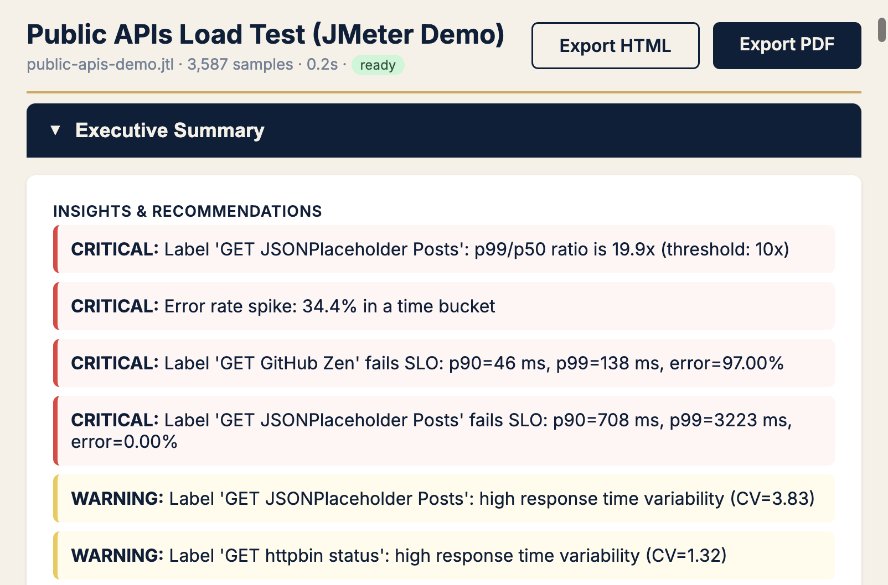
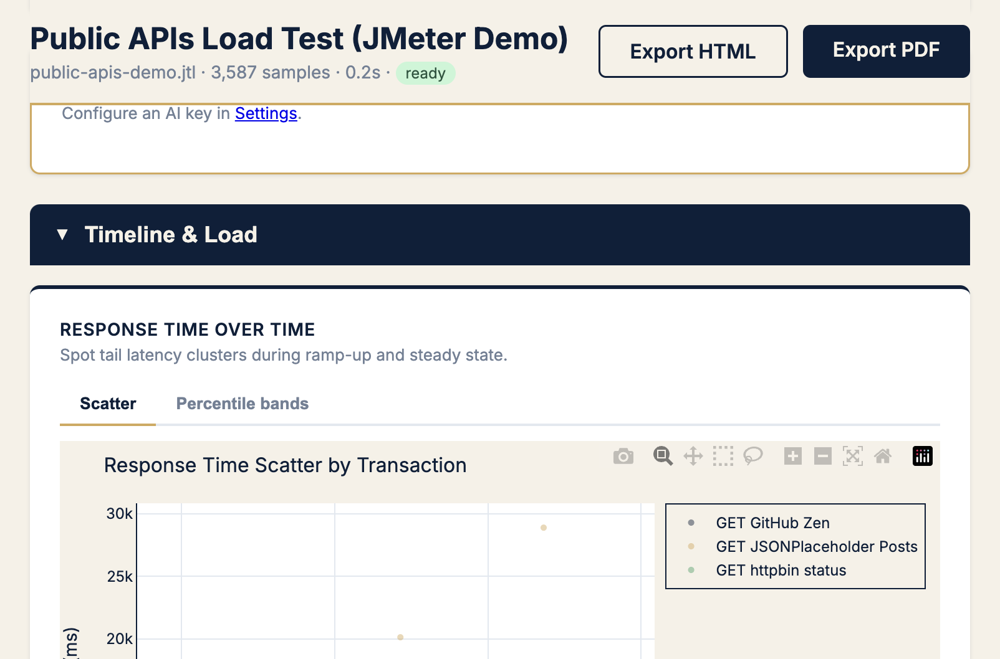
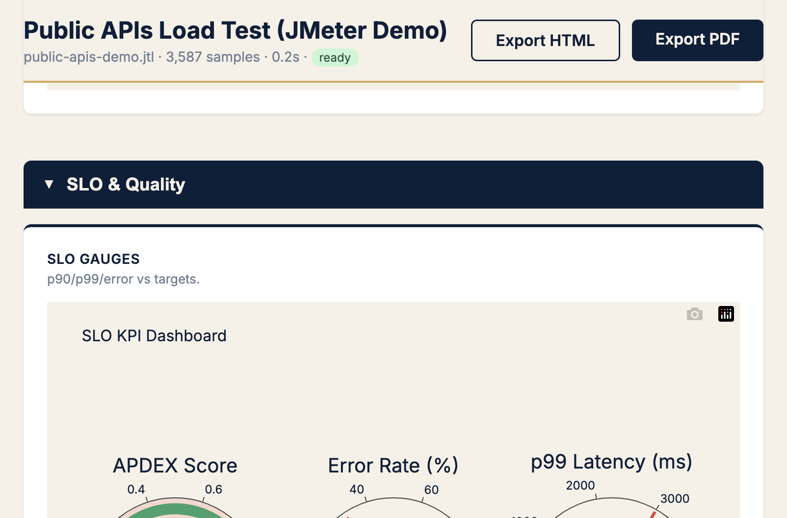
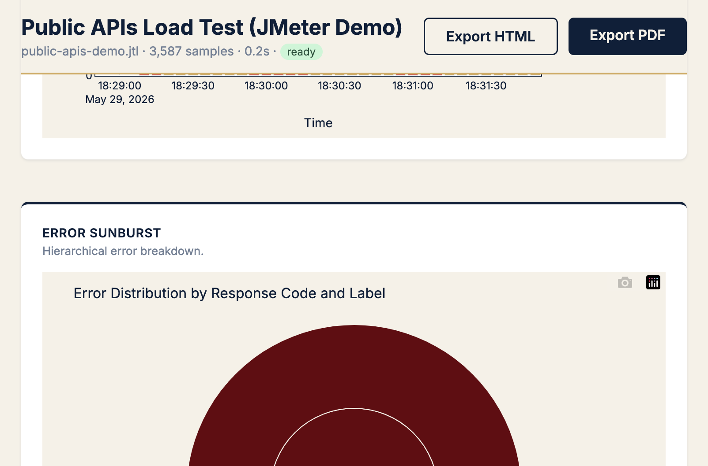

<div align="center">

# PerfSage Reveal

### Uncover what your load test really means

**JMeter reports data. Reveal explains what to do next** — 29 expert charts, SLO verdicts, tail-latency callouts, and plain-English recommendations.

<br />

[](https://hub.docker.com/r/aashu3201/reveal)
[](https://github.com/perfsage/reveal/releases)
[](https://www.python.org/)
[](LICENSE)
[](https://perfsage.com/reveal/)

<br />

[Try it in 60 seconds](#try-it-in-60-seconds) ·
[Symptom → chart](#symptom--chart--kpi) ·
[What you get](#what-you-get) ·
[Install](#installation) ·
[Docs](https://perfsage.com/reveal/) ·
[Playbook](https://perfsage.com/blog/perfsage-reveal-analysis-playbook-which-chart-when/)

<br />



<sub>Real demo run on public APIs — KPIs, SLO fail, and critical recommendations in one screen.</sub>

</div>

---

## Try it in 60 seconds

One container. No Redis setup. No toolchain glue.

```bash
docker pull aashu3201/reveal:latest

docker run -d \
  --name perfsage-reveal \
  -p 8000:8000 \
  -v perfsage-reveal-data:/app/data \
  -e PERFSAGE_SECRET="change-me-to-a-32-char-random-string" \
  aashu3201/reveal:latest
```

Open **[http://localhost:8000](http://localhost:8000)** → drop a `.jtl` / `.csv` / `.xml` → get answers.

> Prefer compose or local Python? Jump to [Installation](#installation).

---

## Why Reveal?

Load tests produce **millions of rows**. Stakeholders need a **release decision** — not another HTML dump of averages.

| JMeter HTML report | PerfSage Reveal |
|--------------------|-----------------|
| Tables & graphs | **Symptom → chart → KPI** triage |
| Averages look green | **p99 / tail ratio** called out |
| You narrate the story | **Recommendations + optional AI** |
| Hard to share cleanly | **One-click HTML / PDF** |

**Mission:** make perf data impossible to ignore and easy to act on.

---

## Symptom → chart → KPI

Stop guessing which tab to open first.

| Symptom | Open first | KPI to decide |
|---------|------------|---------------|
| Users say it's slow, average looks OK | Response time scatter | **p99 ÷ median** (tail ratio) |
| Need a release yes / no | SLO gauges + Apdex | SLO verdict, error % |
| Error rate > 0 | Error sunburst | Errors by label + status |
| Flaky / inconsistent | IQR outlier scatter | CV, outliers beyond IQR |
| Capacity headroom? | RT vs throughput | req/s at knee, p90 at plateau |

Full decision tree → [Field Notes #2 — The Reveal Playbook](https://perfsage.com/blog/perfsage-reveal-analysis-playbook-which-chart-when/)

<p align="center">
  
  &nbsp;
  
</p>
<p align="center">
  
</p>

---

## What you get

| | |
|---|---|
| **29 expert visualizations** | Scatter, heatmaps, CDF, APDEX, SLO gauges, correlation matrices, error sunburst |
| **Smart recommendations** | Tail-latency ratio, saturation knee, error spikes, SLO violations |
| **SLO tracking** | Configurable thresholds, burn-rate timeline, compliance gauges |
| **Optional AI narrative** | GPT-4, Claude, or Gemini — keys encrypted at rest |
| **Shareable exports** | Self-contained HTML or print-quality PDF (charts embedded) |
| **Persistent reports** | Survive restarts — SQLite + Parquet, paginated dashboard |
| **Single Docker image** | Redis + worker + web bundled via supervisord |

---

## Installation

### Option 1 — Docker Hub *(fastest)*

See [Try it in 60 seconds](#-try-it-in-60-seconds) above.

Image: [`aashu3201/reveal`](https://hub.docker.com/r/aashu3201/reveal) · tags: `latest`, semver (`0.1.1`), `sha-…`

### Option 2 — Docker Compose *(teams / durable config)*

```bash
git clone https://github.com/perfsage/reveal.git
cd reveal

cp .env.example .env
# Set PERFSAGE_SECRET to a random 32+ character string

docker compose up -d
```

Open **http://localhost:8000** · logs: `docker compose logs -f`

### Option 3 — Build from source

```bash
git clone https://github.com/perfsage/reveal.git
cd reveal
docker compose build && docker compose up -d
```

Every push to `main` publishes to [Docker Hub](https://hub.docker.com/r/aashu3201/reveal).

### Option 4 — Local Python development

```bash
git clone https://github.com/perfsage/reveal.git && cd reveal
python -m venv .venv && source .venv/bin/activate
pip install -e ".[test]"

docker run -d -p 6379:6379 redis:7-alpine

export PERFSAGE_SECRET="your-32-char-secret-here"
export REDIS_URL="redis://localhost:6379"

# Terminal 1 — API + UI
uvicorn perfsage.main:app --reload

# Terminal 2 — background worker
arq perfsage.core.jobs.queue.WorkerSettings
```

---

## Usage

```
1. Upload   →  Drop .jtl / .csv / .xml (or paste)
2. Analyze  →  Worker ingests → Parquet → expert analysis
3. Explore  →  29 charts, KPIs, recommendations
4. Export   →  HTML or PDF from the report page
5. Manage   →  All Reports → paginate, flush old runs
```

**AI (optional):** Settings → provider + API key → **Generate AI Insights** on any report.

---

## Configuration

| Variable | Default | Description |
|----------|---------|-------------|
| `PERFSAGE_SECRET` | *(required)* | Encrypts AI API keys — **must** be set |
| `REDIS_URL` | `redis://127.0.0.1:6379` | Bundled inside the Docker image |
| `DATABASE_URL` | `sqlite:///./data/perfsage.db` | Report metadata |
| `DATA_DIR` | `data` | Parquet, exports, uploads — **mount a volume** |
| `MAX_UPLOAD_BYTES` | `2147483648` (2 GB) | Max upload size |
| `DEBUG` | `false` | Verbose logging |

---

## Architecture

```
Browser  (HTMX + Plotly.js)
    │  HTTP / SSE
    ▼
FastAPI (uvicorn)  —  web views + REST API
    │
    ├─ Redis  →  arq worker  →  ingest + analysis
    ├─ SQLite (metadata)  +  Parquet (samples & aggregates)
    └─ LLM providers (OpenAI / Anthropic / Gemini) — optional
```

**One Docker container** runs Redis, the worker, and the web server via supervisord.

---

## Supported JMeter formats

| Version | Format | Notes |
|---------|--------|-------|
| 2.x | CSV | Core columns: timeStamp, elapsed, label, responseCode… |
| 3.x – 4.x | CSV | + sentBytes, Latency, Connect, failureMessage |
| 5.x – 5.6 | CSV | Normalised column names (`latency` vs `Latency`) |
| All | XML JTL | `httpSample` and `sample` elements |

*Apache JMeter is a trademark of the Apache Software Foundation.*

---

## Field Notes & related tools

| Resource | Why open it |
|----------|-------------|
| [Reveal product page](https://perfsage.com/reveal/) | Positioning, FAQ, quick start |
| [Launch story](https://perfsage.com/blog/introducing-perfsage-reveal-jmeter-analysis/) | Why Reveal exists |
| [The Reveal Playbook](https://perfsage.com/blog/perfsage-reveal-analysis-playbook-which-chart-when/) | Which chart when |
| [The P99 Trap](https://perfsage.com/blog/the-p99-trap-why-your-load-test-passed-production-failed/) | Why averages lie |
| [SLO Reporter](https://github.com/perfsage/perfsage-slo-reporter) | CI gate inside JMeter |
| [SignalPilot](https://perfsage.com/signalpilot/) | Post-deploy K8s RCA (companion) |

---

## Versioning & releases

| File | Purpose |
|------|---------|
| [`VERSION`](VERSION) | Current semver — Docker tags & health check |
| [`CHANGELOG.md`](CHANGELOG.md) | Release notes |
| Git tags | `v0.1.0`, `v0.1.1`, … → Hub tags |

```bash
# Bump VERSION + CHANGELOG → commit → tag
git tag v0.1.1 && git push origin main --tags
# Actions builds aashu3201/reveal:0.1.1 + :latest
```

---

## Tests

```bash
pip install -e ".[test]"

pytest -q                          # unit + integration
pytest -m "not slow" -q            # skip kaleido PDF renders
pytest tests/e2e/ -q               # app must be on localhost:8000
```

---

## CI / CD

| Workflow | Trigger | Action |
|----------|---------|--------|
| **CI** | Push & PR | Ruff, mypy, pytest |
| **Docker Publish** | `main` or tag `v*` | Multi-arch image → Docker Hub + README sync |

Secrets: `DOCKERHUB_USERNAME`, `DOCKERHUB_TOKEN` — see [`docs/GITHUB_SECRETS.md`](docs/GITHUB_SECRETS.md).

---

## License

MIT — see [LICENSE](LICENSE).

---

<div align="center">

**Stop staring at green averages. Start deciding.**

```bash
docker pull aashu3201/reveal:latest
```

<br />

Built by [**PerfSage**](https://perfsage.com) — *Make Systems Blazing Fast*

[Website](https://perfsage.com/reveal/) ·
[Docker Hub](https://hub.docker.com/r/aashu3201/reveal) ·
[Issues](https://github.com/perfsage/reveal/issues) ·
[hello@perfsage.com](mailto:hello@perfsage.com)

<sub>JMeter is a trademark of the Apache Software Foundation.</sub>

</div>
